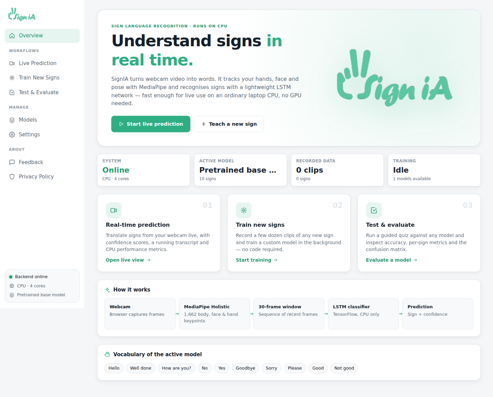

# SignIA: Real-time Sign Language Recognition

SignIA translates sign language from a webcam into text in real time. It tracks the body, face and hands with
**MediaPipe Holistic** and classifies 30-frame sequences of keypoints with a lightweight **LSTM** network. Everything
runs on the **CPU**, so no GPU is needed.



## Features

| Section | What it does |
| --- | --- |
| **Live Prediction** | Continuous recognition from the webcam, with a large on-video caption, top-5 probabilities, a running transcript, and live CPU metrics (FPS, end-to-end latency, landmark and model time). |
| **Train New Signs** | Record clips of any new sign with a guided countdown, manage the recorded dataset, then train a new model in the background with live accuracy and loss curves. Transfer learning from the base model and data augmentation are optional. |
| **Test & Evaluate** | A guided live quiz (random, chosen or free sign) that scores each attempt and builds a confusion matrix, plus an evaluation report (held-out accuracy, per-sign precision, recall and F1, training curves, and evaluation on the recorded dataset). |
| **Models** | Every trained model is kept. Activate, test or delete any of them. |
| **Settings, Feedback, Privacy** | Theme (light, dark or system), camera, frame size, confidence threshold, stability, and recording timings. Plus the feedback form and the privacy policy. |

The interface is designed for recording demo videos:

* **Presentation mode**: press <kbd>F</kbd> (or click *Presentation mode*) to hide the navigation. Press <kbd>Esc</kbd> to leave it.
* Clear status everywhere: connection and LIVE badge, hands detected, pipeline checklist, training progress in the sidebar, and toasts.
* Predictions are paused while no hand is visible, so the demo never shows false positives when nobody is signing.
  You can turn this off in *Settings → Require visible hands*.

## Quick start (Docker)

```bash
docker compose up --build
```

Then open **http://localhost:8000** and allow camera access.

* The webcam is opened **by the browser** and frames are streamed to the server over a WebSocket. No device passthrough
  is needed, so this works with Docker Desktop on macOS and Windows too.
* Recorded clips, trained models and feedback are stored in the `signia-data` Docker volume and persist across restarts.
* Browsers only allow camera access on `localhost` or over HTTPS. To use SignIA from another machine, put it behind an
  HTTPS reverse proxy.

### Configuration

| Variable | Default | Description |
| --- | --- | --- |
| `SIGNIA_MODEL_COMPLEXITY` | `1` | MediaPipe Holistic complexity: `0` is fastest, `1` is balanced, `2` is most accurate. |
| `SIGNIA_TF_THREADS` | `0` | Number of TensorFlow CPU threads (`0` lets TensorFlow decide). |
| `SIGNIA_DATA_DIR` | `/data` | Where clips, models and feedback are stored. |

On slower CPUs, choose **320 px** frames in *Settings → Camera* and set `SIGNIA_MODEL_COMPLEXITY=0`.

## Local development

Backend (Python 3.11):

```bash
cd backend
pip install -r requirements-dev.txt
uvicorn app.main:app --reload --port 8000
pytest            # end-to-end API tests
```

Frontend (Node 20+), in a second terminal:

```bash
cd frontend
npm install
npm run dev       # http://localhost:5173, proxies /api and /ws to :8000
```

`npm run build` writes `frontend/dist`. The backend serves that folder automatically when it exists, so the
production setup is a single process on port 8000.

## How it works

```
Browser webcam ──JPEG frames──▶ FastAPI WebSocket ──▶ MediaPipe Holistic ──▶ 1,662 keypoints/frame
                                                                                   │
        caption, probabilities, landmarks ◀── LSTM (TensorFlow, CPU) ◀── 30-frame sliding window
```

* Only one frame is in flight at a time, so the frame rate adapts to the CPU and latency never builds up.
* The model runs through a traced `tf.function`, which avoids `model.predict()` overhead. One prediction takes a few
  milliseconds on a laptop CPU.
* A sign is accepted when its probability is above the threshold for several consecutive frames (*stability*).
* Training runs in a background thread with the same architecture as the base model (LSTM 64→128→64, Dense 64→32→N).
  Live prediction keeps working while a model trains.

## Project structure

```
backend/
  app/
    main.py        REST API, WebSocket session, static frontend
    vision.py      MediaPipe Holistic + keypoint extraction
    registry.py    model registry (built-in + trained models), fast CPU inference
    dataset.py     recorded clips (.npy, 30 x 1662)
    training.py    background training job, metrics and evaluation
  pretrained/9mots500.h5   pretrained 10-sign model
  tests/           API tests (collect → train → evaluate → predict)
frontend/          React + TypeScript + Vite single-page app
Dockerfile         multi-stage build (Node → Python slim)
docker-compose.yml
```

## Base model vocabulary

The pretrained model recognises 10 signs: Hello, Well done, How are you?, No, Yes, Goodbye, Sorry, Please, Good and
Not good. To evaluate it on your own signing, record clips whose names match these labels in *Train New Signs*, then
use *Test & Evaluate → Evaluation report → Evaluate on dataset*.
